<link rel="stylesheet" href="override-markdown-styles.css"/>

---

<a name="page_1" class="page-number">1</a>

---

Dieses Regelwerk für *Gloomhaven: Knöpfe & Krabbler* soll einfach zugänglich, durchsuchbar und ausdruckbar sein. Es wird mit Korrekturen aktualisiert.

Zuletzt aktualisiert: 23.05.2024

Für mehr Informationen besuche einfach: [feuerland-spiele.de](https://www.feuerland-spiele.de/)

© 2024 Feuerland Verlagsgesellschaft mbH. Alle Rechte vorbehalten.

### Weiter auf dem Pfad des Lernen und Spielens
 
Mit dem ersten Überblick aus dem Spielleitfaden solltest du in der Lage sein, das erste Szenario zu spielen. Danach kannst du hier in dem vollständigen Regelwerk noch einmal alles nachlesen. 

Insbesondere gibt es ein paar Einzelheiten, die nicht in dem Spielleitfaden erklärt werden:

- Gegenstände [p.26](#page_26), [35](#page_35)
- Regenerieren [p.24](#page_24)
- Szenario Effekte [p.7](#page_7), [8](#page_8)
- Gelände [p.9](#page_9)
- Verbesserte Fähigkeiten [p.35](#page_35)

Viel Glück, Abenteurer!

---

<a href="#page_1">🔝</a>&nbsp; &nbsp;<a name="page_2" class="page-number">2</a>

---

# Inhaltsverzeichnis

<table>
<tr><td>
  
<h4 id="getting-started-p3">Getting Started <a href="#page_3">p.3</a></h4>

Choose a Character <a href="#page_4">p.4</a>

Learning the Rules <a href="#page_5">p.5</a>

<h4 id="scenario-phase-p6">Scenario Phase <a href="#page_6">p.6</a></h4>

<h4 id="beginning-a-scenario-p7">Beginning a Scenario <a href="#page_7">p.7</a></h4>

<h4 id="scenario-cards-p8">Scenario Cards <a href="#page_8">p.8</a></h4>

Terrain <a href="#page_9">p.9</a>

Obstacles <a href="#page_9">p.9</a>

Difficult Terrain <a href="#page_9">p.9</a>

Hazards <a href="#page_9">p.9</a>

Pressure Plates <a href="#page_9">p.9</a>

Objectives <a href="#page_9">p.9</a>

<h4 id="playing-a-scenario-p10">Playing a Scenario <a href="#page_10">p.10</a></h4>

Start of Round Effects <a href="#page_10">p.10</a>

Card Selection <a href="#page_10">p.10</a>

Ordering of Initiative <a href="#page_11">p.11</a>

Resolving Ties <a href="#page_11">p.11</a>

Monster Order <a href="#page_11">p.11</a>

Character and Monster Turns <a href="#page_12">p.12</a>

Actions and Abilities Overview <a href="#page_12">p.12</a>

Actions <a href="#page_12">p.12</a>

Abilities <a href="#page_12">p.12</a>

Important Ability Concepts <a href="#page_13">p.13</a>

Target <a href="#page_13">p.13</a>

Allies, Enemies, and Self <a href="#page_13">p.13</a>

Range <a href="#page_14">p.14</a>

Area of Effect <a href="#page_14">p.14</a>

Added Effects <a href="#page_15">p.15</a>

Elements <a href="#page_16">p.16</a>

</td><td>

Abilities <a href="#page_17">p.17</a>

Move <a href="#page_17">p.17</a>

Jump <a href="#page_17">p.17</a>

Flying <a href="#page_17">p.17</a>

Attack <a href="#page_18">p.18</a>

Attack Modification Order <a href="#page_18">p.18</a>

Attack Modifier Tables <a href="#page_18">p.18</a>

Attack Effects <a href="#page_19">p.19</a>

Advantage and Disadvantage <a href="#page_19">p.19</a>

Pierce <a href="#page_19">p.19</a>

Conditions <a href="#page_20">p.20</a>

Positive Conditions <a href="#page_20">p.20</a>

Negative Conditions <a href="#page_20">p.20</a>

Heal <a href="#page_21">p.21</a>

Active Bonuses <a href="#page_21">p.21</a>

Shield <a href="#page_22">p.22</a>

Retaliate <a href="#page_22">p.22</a>

Forced Movement <a href="#page_23">p.23</a>

Control <a href="#page_24">p.24</a>

Suffer Damage <a href="#page_24">p.24</a>

Recover <a href="#page_24">p.24</a>

Character Turns <a href="#page_25">p.25</a>

Ability Cards <a href="#page_25">p.25</a>

Items <a href="#page_26">p.26</a>

Item Limits <a href="#page_26">p.26</a>

Item Usage <a href="#page_26">p.26</a>

Mandatory Triggers <a href="#page_27">p.27</a>

Resting <a href="#page_27">p.27</a>

Lost Actions <a href="#page_28">p.28</a>

Character Damage <a href="#page_28">p.28</a>

Exhaustion <a href="#page_28">p.28</a>

</td><td>

Monster Turns <a href="#page_29">p.29</a>

Monster Cards <a href="#page_29">p.29</a>

Monster Acting Order <a href="#page_30">p.30</a>

Focus <a href="#page_30">p.30</a>

Path Priority <a href="#page_30">p.30</a>

No Focus <a href="#page_30">p.30</a>

Monster Movement <a href="#page_31">p.31</a>

Monster Attacks <a href="#page_31">p.31</a>

Other Monster Abilities <a href="#page_31">p.31</a>

Monsters and Elements <a href="#page_32">p.32</a>

Spawning Monsters <a href="#page_32">p.32</a>

Monster Damage and Death <a href="#page_32">p.32</a>

End of Round <a href="#page_33">p.33</a>

Tracking Rounds <a href="#page_33">p.33</a>

<h4 id="ending-a-scenario-p34">Ending a Scenario <a href="#page_34">p.34</a></h4>

Lost Scenario <a href="#page_34">p.34</a>

Completed Scenario <a href="#page_34">p.34</a>

<h4 id="the-adventure-begins-p35">The Adventure Begins <a href="#page_35">p.35</a></h4>

Item Supplies <a href="#page_35">p.35</a>

Character Progression <a href="#page_35">p.35</a>

Upgraded Ability Cards <a href="#page_35">p.35</a>

<h4 id="appendices">Appendices</h4>

Appendix A: Component Inventory <a href="#page_36">p.36</a>

Appendix B: Monster Turn Guide <a href="#page_37">p.37</a>

Appendix C: Important Reminders <a href="#page_38">p.38</a>

Appendix D: Item Index <a href="#page_39">p.39</a>

Appendix E: Component Errata <a href="#page_40">p.40</a>

<h4 id="credits-p41">Credits <a href="#page_41">p.41</a></h4>

<h4 id="quick-reference-p42">Quick Reference <a href="#page_42">p.42</a></h4>

</td></tr>
</table>

---

<a href="#page_1">🔝</a>&nbsp; &nbsp;<a name="page_3" class="page-number">3</a>

---

## Vor dem Spiel

Oh nein! Du wurdest durch Magie geschrumpft! Um zu deiner vorherigen Größe zurückzukehren, musst du dich in dieser neuen Welt zurechtfinden und eine Reihe von Szenarien bestreiten, die dich durch diese Miniaturwelt führen. Unterwegs findest du vielleicht ein paar Freunde, aber vor allem musst du verschiedene Gegner im Kampf besiegen. Zum Glück bist du ja ein geschickter Söldner mit verschiedenen Fähigkeiten, welche durch deine Karten repräsentiert werden. Um die vielen verschiedenen Gefahren zu bewältigen, die dich auf deiner Reise erwarten, musst du die richtigen Karten zur richtigen Zeit spielen.

Es gibt sechs Charakterklassen mit verschiedenen Fähigkeiten und Spielstilen zur Auswahl. Im weiteren Spielverlauf kannst du deinen Charakter dann mit Gegenständen und fortgeschrittenen Fähigkeitskarten anpassen. 

Dieses Regelwerk versorgt dich mit allen Details, die du brauchst, um das Spiel zu spielen. Falls du schon einmal einen anderen Gloomhaven Titel gespielt hast, werden dir viele Regeln bekannt vorkommen. Wir schlagen dir vor, einmal alles durchzulesen, um ein vollständiges Verständnis für das Spiel zu bekommen. Alle in lila hervorgehobenen Regeln sind neu für Knöpfe & Krabbler und unterscheiden sich von Gloomhaven und Frosthaven.

---

<a href="#page_1">🔝</a>&nbsp; &nbsp;<a name="page_4" class="page-number">4</a>

---

## Charakterauswahl

Die Auswahl eines Charakters und der Anfang deiner Reise in Knöpfe & Krabbler sind einfach: Du wählst einen Charakter aus und fängst an zu spielen.

Für deinen ausgewählten Charakter sammelst du folgende Materialien:

- **Charakterkarte:** Diese Karte bietet eine visuelle Darstellung deines Charakters, zusammen mit deinen maximalen Trefferpunkten auf den verschiedenen Stufen und einem Platz zum Ablegen der Zustandsmarker. Auf der Rückseite befindet sich eine kurze Beschreibung deines Charakters und eine Liste der Fertigkeitskarten und deren Verbesserungen.
- **Spielfigur:** Die Spielfigur aus Plastik repräsentiert deinen Charakter.
- **Fertigkeitskarten:** Es gibt vier doppelseitige Stufe 1 Karten und vier doppelseitige Stufe 2 Karten. Die entsprechenden Fertigkeitskarten sind auf der Rückseite deiner Charakterkarte aufgelistet.
- **Angriffsmodifikator-Ablage:** Diese Ablage zeigt deinen entsprechenden Angriffsmodifikator. Auf Stufe 1 verwendest du die aufgedruckte Tabelle.
- **Fortgeschrittene Angriffsmodifikator-Karten:** Zwei doppelseitige Karten, die im späteren Spielverlauf deine Angriffsmodifikator-Ablage verbessern.
- **braune Zählscheibe:** Sie hält deine Trefferpunkte während eines Szenarios fest.

---

<a href="#page_1">🔝</a>&nbsp; &nbsp;<a name="page_5" class="page-number">5</a>

---

## Die Regeln lernen

Da du nun einen Charakter ausgewählt hast, ist es an der Zeit, die Regeln zu lernen. Wenn du dir lieber ein Video dazu angucken möchtest, findest du es hier:

[feuerland-spiele.de](https://www.feuerland-spiele.de/)

Ein großer Teil des Regelwerks behandelt das Spielen eines einzelnen Szenarios. Da es sich bei Knöpfe & Krabbler aber um ein Kampagnen-Spiel handelt, bei dem du viele Szenarien in einer festgelegten Reihenfolge spielst, gibt es dazu noch einige Informationen nach den grundlegenden Regeln. 

---

<a href="#page_1">🔝</a>&nbsp; &nbsp;<a name="page_6" class="page-number">6</a>

---

## Szenariophase

Szenarien sind eigenständige Missionen und so gestaltet, dass sie in einer Sitzung durchgespielt werden können. Das Szenariendeck enthält zwar 20 Szenarien, aber in einer einzelnen Kampagne werden nicht alle gespielt. Im Gegensatz zu anderen Gloomhaven-Spielen ist die Geschichte von Knöpfe & Krabbler größtenteils linear.

Jede Szenariophase besteht aus drei verschiedenen Schritten:

- **Beginnen eines Szenarios:** In diesem Schritt bereitest du alles vor, was du für das Spielen eines Szenarios benötigst. Dazu gehört der ausgewählte Charakter, die zu bekämpfenden Monster und die Kartenanordnung, auf der der Kampf stattfindet.
- **Spielen eines Szenarios:** Ein Szenario wird über mehrere Runden gespielt. In jeder Runde sind alle Figuren auf der Karte, sowohl dein Charakter als auch die Monster, an der Reihe. So spielst du Runde für Runde, bis ein Szenario verloren oder gewonnen ist.
- **Beenden eines Szenarios:** In diesem Schritt wickelst du die Auswirkungen des Scheiterns oder Bestehens eines Szenarios ab.

---

<a href="#page_1">🔝</a>&nbsp; &nbsp;<a name="page_7" class="page-number">7</a>

---

> ## Beginnen eines Szenarios
> 
> Jedes Mal, wenn du ein Szenario startest, bereitest du es vor, indem du die folgenden Schritte in ihrer Reihenfolge ausführst:
>
> 1. Wähle ein Szenario aus und finde die entsprechende Szenariokarte. **Hinweis:** Du kannst jedes beliebige Szenario spielen, aber für das beste Spielerlebnis empfehlen wir, dem Abschlusstext der vorherigen Szenariokarte zu folgen.
> 1. Lies die Szenarioeinleitung, die Sonderregeln und das Ziel im Szenarioeintrag und überprüfe die Szenariostufe.
> 1. Lege die Monsterkarte für jeden Monstertypen in diesem Szenario bereit.
> 1. Handle alle Szenarioeffekte ab oder schreibe dir eine Notiz, falls diese erst im späteren Spielverlauf abgehandelt werden. Drehe die Szenariokarte auf den Szenarioraum um.
> 1. Lege die Monsterkarten in ihre Ablage und platziere auf jede einen weißen Würfel. Lege außerdem die Monster-Trefferpunkte-Räder in der Farbe bereit, in der die Trefferpunkte auf dem Szenarioraum markiert sind.
> 1. Die bunten Würfel stellen die Monster dar. Platziere sie in der Farbe, in der sie auf der Szenariokarte angezeigt werden. Platziere außerdem deine Charakterfigur auf dem vorgesehenen Startfeld. 
> 1. Lege beide Angriffsmodifikator-Ablagen bereit. Falls das Szenario Stufe 2 oder höher ist, nimm dir die entsprechende Level-Modifikatorkarte für deinen Charakter und lege sie in die Charaktermodifikator-Ablage. Du kannst einen anderen Monster-Schwierigkeitsgrad als “Standart” auswählen, indem du die gewählte Monster-Modifikatorkarte für den entsprechenden Schwierigkeitsgrad in die Monstermodifikator-Ablage legst.
> 1. Halte alle Zustandsmarker, den Würfel und die Symbol-Referenzkarte griffbereit.
> 1. Entscheide, welche Gegenstände du von den verfügbaren Gegenständen ausrüsten willst. (see [p.26](#page_26)).
> 1. Nehme dir die Fertigkeitskarten der Stufe 1 für deinen Charakter und wähle eine Anzahl an Karten aus, die du verbessern möchtest. Die Anzahl entspricht der Szenariostufe minus eins. Ersetze dann die ausgewählten Fertigkeitskarten der Stufe 1 durch die entsprechenden Fertigkeitskarten der Stufe 2 (abgebildet auf der Rückseite deiner Charakterkarte). Die ausgewählten Karten nimmst du direkt auf deine Hand. 
> 1. Stelle das Trefferpunkte-Rad deines Charakters auf deinen maximalen Trefferwert. Diesen findest du auf deiner Charakterkarte in der Tabelle unter der Szenariostufe. Stelle nun die entsprechenden Monster-Trefferpunkte-Räder für die jeweiligen Monster auf ihren maximalen Trefferwert.
> 1. Wende alle verbleibenden Szenarioeffekte an. 

---

<a href="#page_1">🔝</a>&nbsp; &nbsp;<a name="page_8" class="page-number">8</a>

---

> ### Szenariokarten
> 
> Jede Karte enthält einen Szenarioeintrag mit allem, was du zum Spielen diesen Szenarios wissen musst. Meistens sind folgende Informationen vorhanden:

<blockquote>
  <ol type="A">
    <li>Nummer, Name und Stufe des Szenarios.</li>
    <li>Eventuell ein vorgegebener Charakter.</li>
    <li>Eine Einführung in das Szenario.</li>
    <li>Eine Liste der anzutreffenden Monster.</li>
    <li>Das Ziel des Szenarios. Sobald du dieses erreicht hast, ist das Szenario bestanden, und du liest dir den Abschluss des Szenarios nach deiner aktuellen Runde durch.</li>
    <li>Eventuelle Sonderregeln für dieses Szenario.</li>
    <li>Dieser Abschluss des Szenarios.</li>
    <li>Das nächste oder die nächsten Szenarios, die in der Kampagne gespielt werden.</li>
  </ol>
</blockquote>

> Auf der Raumseite jeder Szenariokarte werden alle Raumdetails gezeigt. Dazu gehören folgende Informationen:

<blockquote>
  <ol type="A">
    <li><strong>Startfeld:</strong> Am Anfang des Szenarios stellst du deine Figur auf dieses Feld.</li>
    <li><strong>Gelände:</strong> Auf diesen Feldern gelten besondere Raumeigenschaften (see <a href="#page_9">p.9</a>).</li>
    <li><strong>Monsterfelder:</strong> Auf diesen Feldern ist ein Monster abgebildet. Platziere den jeweilgen Monsterwürfel auf das Feld mit der entsprechenden Farbe.</li>
    <li><strong>Besondere Felder:</strong> Diese Felder sind mit einem Buchstaben markiert und werden in den Sonderregeln des Szenarios erläutert.</li>
  </ol>
</blockquote>

---

<a href="#page_1">🔝</a>&nbsp; &nbsp;<a name="page_9" class="page-number">9</a>

---

### Gelände

Jedes Szenario besteht aus verschiedenen Geländetypen. Dieser Typ wird durch die Farbe des Feldrandes festgelegt und nicht durch die Illustration. Ein Feld ohne einen farbigen Rand ist  <strong>merkmallos</strong>. Ein Feld, auf dem keine Figur steht, ist <strong>unbesetzt</strong>. Ein Feld das sowohl merkmallos als auch unbesetzt ist, ist <strong>leer</strong>. 

#### Hindernisse

  
  
Figuren können nicht ein Feld mit einem Hinderniss betreten, außer sie fliegen. Es kann aber über ein Hindernis gesprungen werden. Reichweite darf durch Hindernisse gezählt werden. Hindernisse fangen keine Fernagriffe ab.

#### Schwieriges Gelände	

  
  
Figuren müssen 2 Bewegungspunkte verbrauchen, um ein schwieriges Gelände zu betreten, außer sie fliegen oder springen (auch wenn der Sprung auf diesem Feld endet).

> #### Gefahren

<blockquote>
  

    
    
Wenn eine Figur ohne zu fliegen oder springen ein Gefahrenfeld betritt, wird ein Effekt auf diese Figur angewendet. Es gibt viele verschiedene Effekte und sie werden auf der jeweiligen Szenariokarte spezifiziert. Figuren erleiden keinen Effekt, wenn sie auf einem Gefahrenfeld eine Runde beginnen oder dieses verlassen. Falls aber eine Sprungbewegung auf einem Gefahrenfeld beendet wird, wird ein Effekt angewendet. Wenn eine Figur sich auf einem  <strong>Immobiliseren</strong>Gefahrenfeld befindet (see p.20), gilt sie als Hindernis für die Bewegung anderer Figuren.

  

</blockquote>

#### Druckplatten

  
  
Das Auslösen einer Druckplatte und ihr Effekt wird in den Sonderregeln des jeweiligen Szenarios beschrieben. Druckplatten gelten als leere Felder.

#### Ziele 

	
	
Objectives sind mit den Zielen einiger Szenarien verbunden und müssen in der Regel angegriffen oder beschützt werden. Objectives können angegriffen werden, sind aber immun gegen alle Zustände und erzwungene Bewegungen. Objectives haben eine Initiative von 99 wenn sie fokussiert werden, außer die Sonderregel des Szenarios schreibt etwas anderes vor. Außerdem sind sie nie am Zug. Objectives gelten als Figur. Die Felder, die sie belegen, sind gelten als besetzt. Objectives sind keine Hindernisse. Die Sonderregel des jeweiligen Szenarios beschreibt, wie das Objective mit dem Ziel des Szenarios zusammenhängt.

---

<a href="#page_1">🔝</a>&nbsp; &nbsp;<a name="page_10" class="page-number">10</a>

---

# Spielen eines Szenarios 

Sobald ein Szenario aufgebaut ist, kannst du loslegen! Jedes Szenario wird in einer Reihe von Runden gespielt. Jede Runde besteht aus den folgenden Schritten:
1. Rundenbeginn mit Szenarioeffekten
1. Kartenauswahl
1. Reihenfolge bestimmen
1. Charakter- und Monsterzüge
1. Rundenende
Diese Schritte werden wiederholt, bis das Szenarioziel erreicht ist.

## Rundenbeginn mit Szenarioeffekten

Wende zu Beginn der Runde alle Effekte aus den Szenarioregeln an, wie zum Beispiel das Erscheinen von Monstern. Diese Effekte können in beliebiger Reihenfolge angewendet werden, das Erscheinen sollte jedoch gleichzeitig passieren.  (see [p.32](#page_32)).

## Kartenauswahl

Nachdem alle Effekte angewendet wurden, wählst du zwei Fertigkeitskarten aus deiner Hand aus, die du während der Runde ausspielst. Eine dieser beiden Karten gilt als Initiativkarte. Der Initiativwert in der Mitte der Karte bestimmt deine Position in der Initiativreihenfolge.  (see [p.11](#page_11)).

Alternativ kannst du eine lange Pause ansagen, wenn du mindestens zwei Karten auf der Hand und/oder im Ablagestapel hast. (see [p.27](#page_27)). Die lange Pause hält die gesamte Runde an und wärendessen hast du eine Initiative von 99 und darfst keine Karten spielen.

---

<a href="#page_1">🔝</a>&nbsp; &nbsp;<a name="page_11" class="page-number">11</a>

---

## Reihenfolge bestimmen
Nachdem du entweder zwei Fertigkeitskarten ausgewählt oder eine lange Pause angesagt hast, legst du alle Monsterinitiativen und -aktionen fest. Für jeden Monstertyp, der mindestens einmal auf dem Spielplan vertreten ist, würfelst du und bewegst den weißen Würfel auf die entsprechende Aktion. 

Dann bestimmst du die Initiativreihenfolge, indem du die Initiativwerte auf deiner ausgewählten Karte und allen gewürfelten Monsteraktionen vergleichst. Vom niedrigsten zum höchsten Initiativwert gibt dies dann die Zugreihenfolge für diese Runde an. Bei einer langen Pause hast du eine Initiative von 99.

## Gleichstand auflösen

Wenn ein Gleichstand zwischen deiner Intitative und der eines Monsters besteht bist du zuerst an der Reihe.

## Reihenfolge der Monster

Jedes Monster ist gemäß der Initiativreihenfolge am Zug. Alle Monster der gleichen Art haben die gleiche Initiative und sind in aufsteigender, numerischer Reihenfolge an der Reihe. (see [p.30](#page_30)).

---

<a href="#page_1">🔝</a>&nbsp; &nbsp;<a name="page_12" class="page-number">12</a>

---

## Charakter- und Monsterzüge 		

Jede Figur auf der Karte — sowohl deine als auch die Monster — ist in jeder Runde einmal an der Reihe. Der Zug einer Figur beginnt, wenn die vorherige Figur ihren Zug beendet hat, und endet, wenn die nächste Figur ihren Zug beginnt. Während des Zuges einer Figur führt sie die Aktionen und Fähigkeiten auf ihren Karten aus.

Bevor wir uns mit den Einzelheiten der Spielzüge von Charakteren und Monstern befassen, müssen wir uns noch mit der Funktionsweise von Aktionen und Fähigkeiten befassen.

### Aktionen und Fähigkeiten		

#### Aktionen

Eine **Aktion** ist eine Reihe von einer oder mehreren Fähigkeiten, die auf einer Hälfte einer Fertigkeitskarte detailliert beschrieben werden. Normalerweise führst du in einem Zug zwei Aktionen aus: die obere Aktion einer deiner ausgespielten Fertigkeitskarte und die untere Aktion der anderen. Eine ganze Hälfte einer Fertigkeitskarte gilt als Einzelaktion.

Monster führen in ihrem Zug eine Aktion aus. Die gesamte Fertigkeitsspalte ist eine einzelne Aktion.

Eine Aktion wird durch ihre Fertigkeiten definiert. Zum Beispiel, wenn eine Aktion sowohl eine "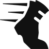 **2**" Fertigkeit als auch eine "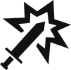 **2**" Fertigkeit beinhaltet, kann sie sowohl als Bewegungs- als auch als Angriffsaktion bezeichnet werden.

#### Fertigkeiten

Eine **Fertigkeit** ist jede Gruppe von Texten und/oder Symbolen (oft zu finden auf einer Fertigkeitskarte oder Monsteraktion), die eine Figur ausführen kann, um mit der Karte, sich selbst oder anderen Figuren zu interagieren.

Besteht eine Aktion aus mehreren Fertigkeiten, werden diese durch Fertigkeitsininen voneinander getrennt

Fertigkeiten in einer Aktion werden immer in der Reihenfolge ausgeführt, in der sie angegeben sind. Figuren können während sie eine Fertigkeit ausführen keine neue Fertigkeit ausführen, mit Ausnahme bon Fähigkeiten aus Angriffsmodifikatoren.

Charakterfertigkeiten können übersprungen werden, solange sie nicht zwingend erforderlich sind. (siehe [p.27](#page_27)).

---

<a href="#page_1">🔝</a>&nbsp; &nbsp;<a name="page_13" class="page-number">13</a>

---

### Wichtige Fähigkeitenkonzepte

#### Ziele

 Die meisten Fertigkeiten zielen auf eine oder mehrere Figuren. "Ziele" gibt an, welche Art von Figur bzw. wie viele Figuren die Fertigkeit trifft. Die Anforderungen für das Zielen werden manchmal ausgeschrieben, oft handelt es sich aber nur um eine Zahl. "**Zielen X**" ermöglicht es der handelnden Figur, bis zu X verschiedene Figuren innerhalb der Reichweite der Fähigkeit zu treffen. Alle Beschränkungen und zusätzliche Effekte der Fähigkeit gelten für alle Ziele. Eine Figur mehrmals mit der gleichen Fähigkeit zu treffen ist nicht möglich, sofern nicht anders angegeben.

Wenn "Ziele" nicht spezifisch aufgeführt ist, ist der Zielwert 1. Es kann also nur eine Figur anvisiert werden.

#### Gezielte Fertigkeiten

Angriff ([p.18](#page_18)), Zustände ([p.20](#page_20)), Heilung ([p.21](#page_20)), erzwungene Bewegungen ([p.23](#page_23)), und das kontrollieren von Figuren ([p.24](#page_24)) sind die einzigen gezielten Fertigkeiten. Diese können nicht ausgeführt werden, wenn kein gütliges Ziel in Reichweite ist.

#### Verbündete, Gegner und man selbst

Monster sind Verbündete andere Monster und du und die Monster sind einander Gegner. **Figuren sind nicht ihre eigenen Verbündeten.**

Generell können negative Fertigkeiten nur auf Gegner und positive Fähigkeiten nur auf Verbündete oder die handelnde Figur angewendet werden.

Fertigkeiten die als Ziel nur "selbst" angeben, können nur auf die handelnde Figur angewendet werden.

---

<a href="#page_1">🔝</a>&nbsp; &nbsp;<a name="page_14" class="page-number">14</a>

---

#### Reichweite

 Die meisten Fertigkeiten zielen nur auf eine Figur. Die Reichweite gibt an, wie weit diese Figur entfernt sein kann. "Reichweite X" bedeutet, dass die handelnde Figur jede Figur innerhalb der X Felder anvisieren kann, auch sich selber. Reichweite kann durch Hindernisse und Figuren gezählt werden.

Jede Fertigkeit, deren Reichweite in dem hervorgehobenen Abschnitt rechts von der Fertigkeit angegeben ist, gilt als Fernkampfangriff. 

Jede Figur behandelt das Feld, auf dem sie stehen, als benachbart, wenn es um das Anvisieren geht. Das Drehen und Spiegeln des dargestellten Wirkungsbereiches ist erlaubt.

#### Wirkungsbereich

Fertigkeiten mit einem Wirkungsbereich lassen die handelnde Figur mehrere Felder gleichzeitig anvisieren.

  
  
Ein graues Feld markiert das Feld, in dem die handelnde Figur sich befindet. Jeder Angriff mit einem Wirkungsbereich, bei dem ein graues Feld abgebildet ist, gilt als Nahkampfangriff. (siehe <a href="#page_18">p.18</a>).

  
  
Rote Felder markieren die Felder, in denen Figuren anvisiert werden können. Es reicht, wenn sich nur ein rotes Feld in der Reichweite der Fertigkeit befindet. Dieses Feld muss nicht zwingend eine Figur enthalten. .

Wenn eine Fertigkeit mit einem Wirkunsbereich "**+1**  erhält," kann eine weitere Figur außerhalb des Wirkungsbereiches, aber innerhalb der Reichweite der Fertigkeit anvisiert werden. Dies bedeutet nicht, dass der gesamte Wirkungsbereich erneut angewendet wird. Es darf lediglich ein zusätzliches Feld anvisiert werden.

---

<a href="#page_1">🔝</a>&nbsp; &nbsp;<a name="page_15" class="page-number">15</a>

---

#### besondere Effekte

Besondere Effekte sind an eine Fertigkeit angehängt und verändern sie auf irgendeine Weise. Häufige besondere Effekte, wie " **X**," " **X**," oder Zustände werden normalerweise in dem hervorgehobenen Abschnitt rechts von der Fertigkeit definiert. Alle bedingten Effekte — solche, die vom Verbrauch eines Elementes (siehe [p.16](#page_16)) oder der Zahlung anderer Kosten abhängig sind — werden unter der Fertigkeit in einem hervorgehoben Abschnitt mit gepunkteter Umrandung angegeben.
Besondere Effekte können übersprungen werden, aber dies muss vor dem Würfeln des Angriffsmodifikatores entschieden werden. Bedingte Effekte können ebenfalls übersprungen werden; du bist nicht verpflichtet, die Kosten zu bezahlen. Und selbst wenn du die Kosten bezahlt hast, kannst du dich noch dafür entscheiden, den Effekt nicht anzuwenden. Im Falle eines überspringbaren Effekts, der an eine Angriffsfähigkeit mit mehreren Zielen angehängt ist, kannst du dich bei jedem einzelnen Ziel entscheiden, ob du den Effekt anwendest oder nicht. Auch hier muss das immer vor dem Würfeln des Angriffsmodifikators geschehen, sofern es nicht anders angeben ist.

Komplexere besondere Effekte können unter einer Fertigkeit erläutert werden, aber solch ein Text ist nicht immer ein besonderer Effekt. Jeder Text, der Regeln für die Ausführung einer Fertigkeit (z.B. eine Zielbeschränkung) enthält, ist ein fester Bestandteil dieser Fertigkeit und kann nicht übersprungen werden.

---

<a href="#page_1">🔝</a>&nbsp; &nbsp;<a name="page_16" class="page-number">16</a>

---

> #### Elemente 
> 
> Einige Aktionen sind mit einem Element verbunden (Feuer, Eis, Luft, Erde, Licht oder Dunkelheit). Elementanreicherungen auf deinen gespielten Fertigkeitskarten, deinen Handkarten und im aktiven Bereich, sowie Elementanreicherungen auf den gewürfelten Monsteraktionen können jeweils einmal pro Runde verbraucht werden. Es können mehrere Anreicherungen des selben Elementes verfügbar sein und in der selben Runde verbaucht werden.
> 
> |  |  |  |  |  |  |
> | Feuer | Eis | Luft | Erde | Licht | Dunkelheit |
> 
> Eine Elementanreicherung ist verfügbar, solange sie sichtbar ist und in der aktuellen Runde noch nicht verbraucht wurde (verpflichtend). Eine Elementanreicherung auf einer Fertigkeitskarte ist nicht mehr verfügbar, sobald diese Karte abgeworfen, verloren oder auf die andere Seite gedreht wird. Wenn eine Fertigkeitskarte auf die B-Seite umgedreht oder auf die Hand zurückgenommen wird, ist eine sichtbare Elementanreicherung wieder verfügbar. Eine Elementanreicherung bei einer gewürfelten Monsteraktion ist nur einmal verfügbar, auch wenn sich mehrere Monster desselben Typs auf dem Spielplan befinden. Eine Elementanreicherung bei einer gewürfelten Monsteraktion ist nicht mehr verfügbar, sobald alle Monster dieses Typs besiegt wurden.
> 
> Elementanreicherungen können verbraucht werden, um bestimmten Fertigkeiten Effekte hinzuzufügen, oder in manchen Fällen ganz neue Fertigkeiten auszuführen. Dies wird durch ein mit  markiertes Elementsymbol dargestellt, gefolgt von einem hinzugefügten Effekt. Wenn dieses Element verfügbar ist, kann es verbraucht werden. Immer wenn eine Elementanreicherung verbraucht wird, kann sie erst in der nächsten Runde erneut verbraucht werden. (Du kannst dir dies mit einem Ersatzwürfel oder einem anderen kleinen Gegenstand markieren, um es nicht zu vergessen.)
> 
> Wenn eine Fertigkeit mehrere seperate Elementanreicherungen darstellt, wählt die handelnde Figur aus, welche aktiviert werden soll. Wenn eine einzelne Elementanreicherung mehrere Elemente darstellt, müssen all diese Elemente verbraucht werden, um sie zu aktivieren. Es können mehrere Elemente auch mehrmals gleichzeitg benutzt werden, aber jede Elementanreicherung kann maximal einmal pro Runde verbraucht werden.
> 
>  Das Wild-Symbol stellt eines der sechs Elemente dar (nicht alle). Ein zusätlicher Effekt, der den Verbrauch eines wilden Elements erfordert, kann mit einem beliebigen Element bezahlt werden. Eine Anreicherung des wilden Elementes kann als eines der sechs Elemente verbraucht werden.
> 
>  Ein Symbol mit gemischten Elementen, das zwei Elemente innerhalb desselben Rahmens darstellt, stellt eines dieser beiden Elmente dar (jedoch nicht beide). Ein zusätzlicher Effekt, der den Verbrauch eines gemischten Elementes erfordert, kann durch den Verbrauch eines der beiden Elemente bezahlt werden. Eine gemischte Elementanreicherung kann als eines der beiden Elemente vebraucht werden.

---

<a href="#page_1">🔝</a>&nbsp; &nbsp;<a name="page_17" class="page-number">17</a>

---

## Fertigkeiten

### bewegen

 "**bewegen X**" ist eine Fertigkeit, die einer Figur X Bewegungspunkte gibt. Diese Figur kann dann diese Punkte ausgeben, um sich ein Feld pro Bewegungspunkt zu bewegen. Figuren können sich durch Verbundete, aber nicht durch Gegner, Hindernisse oder Ziele bewegen.

Eine Figur muss ihre Bewegung immer auf einem nicht besetzten Feld beenden. Eine Figur muss sich mindestens ein Feld weit bewegen, um eine Bewegungsfertigkeit ausgeführt zu haben.

Alle nicht ausgegeben Bewegungspunkte verfallen mit dem Ende der Bewegungsfetigkeit.

#### springen

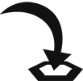 "**springen**" ist ein zusätzlicher Effekt einer Bewegungsfertigkeit. Springen erlaubt einer Figur alle Gegner, Hindernisse, Gefahren und Ziele zu ignorieren, außer auf dem letzten Feld.
Schwieriges Gelände wird beim springen vollständig ignoriert.

#### fliegen

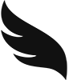 "**Fliegen**" ist ein aktiver Bonus (siehe [p.21](#page_21)). Fliegen erlaubt einer Figur alle Gegner, Hindernisse, Gefahren und Ziele zu ignorieren, auch auf dem letzten Feld. Allerdings kann eine fliegende Figur ihre Bewegung immer noch nicht auf einem Feld beenden, das schon von einer anderen Figur besetzt ist (und umgekehrt).

---

<a href="#page_1">🔝</a>&nbsp; &nbsp;<a name="page_18" class="page-number">18</a>

---

### Attack

 "**Attack X**" is a negative targeted ability that allows a figure to deal a base amount of X damage to an enemy within the specified range.

An attack with no specified range () value is considered a **melee attack** with range 1, capable of targeting adjacent enemies only, unless otherwise stated. An attack with any specified range () value is considered a **ranged attack**, regardless of the distance to the target.

An **attack** is a single attack performed against one target, an **attack ability** is an ability that consists of one or more separate attacks, and an **attack action** is any action that contains at least one attack ability.

#### Attack Modification Order

When an attack is performed, the base attack value written on the card can be modified in three different ways, which occur in the following order:

1. All applicable attack bonuses and penalties—such as "**±X** " effects, including poison (see [p.20](#page_20))—are applied.
1. An attack modifier is rolled and applied.
1. The target’s shield bonus is applied (see [p.22](#page_22)).

Once all modifications have been applied, the target suffers the resulting amount of damage. If the target has any abilities or effects which can negate a source of damage, including discarding or losing cards to negate damage (see [p.28](#page_28)), they may apply them now.

These steps are repeated for each individual target of the attack ability, which means it is possible for different targets to suffer different amounts of damage from the same attack ability.

> #### Attack Modifier Tables
> 
> Any time an attack ability is performed, **a separate attack modifier is rolled for each individual target of the attack ability** by rolling the die and consulting the attack modifier table. The rolled modifier is the modifier in the current row and the column matching the die roll (, , ). The rolled modifier is then applied to the attack, possibly reducing or increasing its value. Once the effects of a rolled modifier have been applied, move the modifier tracker cube down one row. (If you have difficulty remembering to move the cube after the attack, you can try moving the cube first and using the modifier from the row the cube moves to. If you do, the cube should start the scenario in the last slot instead of the first.)
> 
> Attack modifiers are only rolled for attacks. They are not used for any other type of effect that deals damage.
> 
> You have your own attack modifier table, while all monsters share a single table.
> 
> Each character class and all monsters start with a standard table of six , four 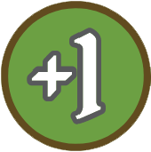, four 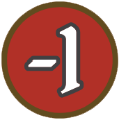, one 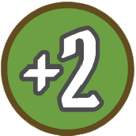, one 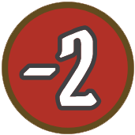, one 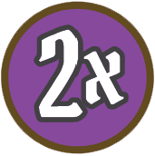, and one , but each character class table improves as the campaign progresses (see [p.35](#page_35)), allowing for other effects.
> 
> An attack modifier can have the following:

<quoteblock>
  <ol type="A">
    <li><strong>Modifier Value:</strong> This value modifies the attack value. The  modifier reduces the final attack value to zero. The  modifier doubles the current attack value.</li>
    <li><strong>Added Effects:</strong> Some modifiers have conditions (see <a href="#page_20">p.20</a>) or other added effects. When activated, these added effects function exactly as if written on the attack ability.</li>
  </ol>
</quoteblock>

---

<a href="#page_1">🔝</a>&nbsp; &nbsp;<a name="page_19" class="page-number">19</a>

---

#### Attack Effects

An attack effect is an effect attached to an attack. These effects are applied either during damage resolution or after the attack resolves. If applied after the attack resolves, the attack effect is still applied, even if the attack deals no damage (including due to a  modifier).

The attacker must choose whether to apply any attack effects before they roll an attack modifier. All attack effects except "**add** " are applied before any retaliate bonus (see [p.22](#page_22)). The "**add** " effect allows the attacker to perform additional attacks, and each attack must be resolved completely before another can be performed.

Some attacks have abilities (e.g., heal abilities) that aren’t attack effects but are still attached to the attack. These abilities are performed after the attack is resolved completely (including after any retaliate bonus).

Some modifiers have added effects, besides modifying the attack value, and **an attacking character can always choose** whether to apply those effects after the modifier is rolled.

#### Advantage and Disadvantage

> Some effects cause an attack to gain advantage or disadvantage. With **advantage**, the attacker rolls two modifiers on the same row and uses one of them. A monster always uses the better one (e.g.  over  or ;  over ), but you may use either one.
>
> With **disadvantage**, the attacker rolls two modifiers on the same row and always uses the worse one (e.g.  over  or ;  over ).

An attack cannot gain multiple instances of advantage or disadvantage. If an attack has both advantage and disadvantage, it is considered to have neither.

Any ranged attack on an adjacent enemy automatically gains disadvantage.

#### Pierce

 "**Pierce X**" is an added effect that reduces the target’s shield bonus (see [p.22](#page_22)) by X. Multiple " **X**" effects can be combined. For example, if an attack with " **2**" gains " **3**," the effect would reduce the target’s shield bonus by 5 for that attack.

---

<a href="#page_1">🔝</a>&nbsp; &nbsp;<a name="page_20" class="page-number">20</a>

---

### Conditions

A condition ability is a positive or negative targeted ability, depending on the specified condition, and causes the target of the ability to gain that condition.

When you gain a condition, place the matching token on your character card. When a monster gains a condition, place the matching token near its respective hit point dial. 

Once gained, a condition remains until the requirements for its removal are met. Neither positive nor negative conditions can be removed voluntarily. A figure cannot have multiple instances of the same condition; however, if a figure gains a condition they already have, the effect’s duration resets.

If a figure gains a condition during their turn that is removed "at the end of the figure’s next turn," the condition goes into effect immediately and applies until the end of their next turn. Conditions which are removed at the end of a figure’s turn are only removed after all other end-of-turn effects are resolved.

A condition effect can also be added to other abilities as an added effect, causing all targets of the ability to gain that condition after its main effect is resolved. If the ability is an attack, the target gains the condition even if the attack dealt no damage, but they do not gain the condition if the attack killed or exhausted them, or if they are immune.

#### Positive Conditions

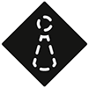 **Invisible:** The figure cannot be targeted by any enemy, though non-targeted abilities remain unaffected. The invisible figure and their allies can still interact with each other. Invisible is removed at the end of the figure’s next turn.

 **Strengthen:** The figure gains advantage on all of their attacks. Strengthen is removed at the end of the figure’s next turn.

#### Negative Conditions

 **Wound:** The figure suffers 1 damage at the start of each of their turns. Wound is removed when the figure is healed, and the figure is healed by the ability as normal. (You can place the token covering a monster’s ability text to help you remember.)

 **Poison:** All attacks targeting the figure gain "**+1** ." Poison is removed when the figure is healed but, unlike wound, poison prevents the heal from increasing the figure’s current hit point value. (You can place the token by your or the monster’s hit points to help you remember.)

 **Immobilize:** The figure cannot perform any move abilities. Immobilize is removed at the end of the figure’s next turn.

 **Disarm:** The figure cannot perform any attack abilities. Disarm is removed at the end of the figure’s next turn.

 **Muddle:** The figure gains disadvantage on all of their attacks. Muddle is removed at the end of the figure’s next turn.

---

<a href="#page_1">🔝</a>&nbsp; &nbsp;<a name="page_21" class="page-number">21</a>

---

### Heal

 "**Heal X**" is a positive targeted ability that allows the target to heal X amount of damage, increasing their current hit point value. When damage is healed, update the target’s hit point dial to reflect the new hit point total.

A figure’s current hit point value can never exceed their maximum hit point value, though it is permitted to target a figure that is already at their maximum hit point value with a heal ability; this can be done to remove poison or wound.

Heal effects from attack modifiers function exactly like heal abilities.

A single heal can remove any combination of wound and poison from a figure. However, if poison is present, the hit point increase is prevented.

### Active Bonuses

An active bonus ability is any ability that provides an active bonus to a figure or their allies. When a character performs an active bonus ability, the card is placed in their active area to track the bonus.

> Active bonus abilities have icons to indicate the duration of the bonuses they provide. When a bonus expires, even if the action has other active bonus abilities, the card is removed from the character’s active area; an A-side card is flipped to its B-side and returned to your hand, a B-side card is placed in your discard pile, or the card is placed in your lost pile if the action has a lost icon (see [p.28](#page_28)).

 **Round Bonuses:** These bonuses activate when the ability is performed and expire at the end of the round.

 **Persistent Bonuses:** These bonuses activate when the ability is performed and expire when the specified removal condition has been fulfilled.

A character may voluntarily remove a card with a persistent bonus (but not a round bonus) from their active area before the bonus expires, but doing so removes the bonus. This can be done at any time except during another ability. Because cards with persistent bonuses in your active area can be dismissed, you can consider them to be in the zone they will be moved to once dismissed; that is the hand for A-side cards, the discard pile for B-side cards, or the lost pile for any card with a lost icon. As such, cards with persistent bonuses in your active area can count toward the two cards in your hand and/or discard pile required to rest (see <a href="#page_27">p.27</a>). Likewise, they can be dismissed and then discarded or lost to negate damage (see <a href="#page_28">p.28</a>). When you recover discarded cards (by resting, for example) or lost cards (through special actions), you have the choice of recovering cards in your active area or leaving them in the active area.

Actions with active bonus abilities might also have other abilities, but these other abilities are only performed when the card is played. There is a wide variety of active bonus abilities. While these abilities are usually defined by text, there are two common ones with additional rules.

---

<a href="#page_1">🔝</a>&nbsp; &nbsp;<a name="page_22" class="page-number">22</a>

---

#### Shield

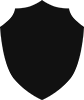 "**Shield X**" is a positive ability that gives the acting figure a shield bonus of X. This reduces the attack value of an incoming attack by X. The shield bonus is only applied after all attack bonuses or penalties and modifiers have been applied. Multiple shield bonuses stack with one another as a single reduction in attack value. A shield bonus does not apply to sources of damage that are not attacks and does not negate added effects.

A shield ability applies to the acting figure unless otherwise specified.

#### Retaliate

 "**Retaliate X**" is a positive ability that gives the acting figure a retaliate bonus of X. This deals X damage to any figure who attacks them, if they are within the specified range after all attack effects are resolved (including push or pull). If no range is specified, the bonus is only applied to adjacent attackers. This bonus is triggered by each attack and occurs after the attack is resolved.

> Some retaliate abilities include added effects, such as push or conditions. These effects are applied after the retaliate damage is applied.

A retaliate bonus is not an attack or targeted effect, therefore the damage cannot be reduced by a shield bonus. If a retaliating figure is killed or exhausted by an attack, the retaliate bonus does not occur. Multiple retaliate bonuses stack with one another as a single source of damage, but each retaliate bonus is only applied within its specified range.

A retaliate ability applies to the acting figure unless otherwise specified.

---

<a href="#page_1">🔝</a>&nbsp; &nbsp;<a name="page_23" class="page-number">23</a>

---

### Forced Movement

Forced movement is any negative targeted ability that allows a figure to control another figure’s movement. Forced movement must follow all normal movement rules for the target. For example, if a flying figure is forced to move, flying still applies.

There are two primary forced movement abilities:

 "**Push X**" forces the target to move up to X hexes away from the acting figure. Each individual hex entered must place the target farther by range from the acting figure.

 "**Pull X**" forces the target to move up to X hexes toward the acting figure. Each individual hex entered must place the target closer by range to the acting figure.

When you perform a push or a pull, you decide the direction and distance that the target moves. When you push or pull the target into a hazard hex, it suffers the effects of that hazard hex unless it’s flying.

When a monster performs a push or a pull, you decide the direction, but the target must move as far as possible. Push and pull are unaffected by difficult terrain, but all other normal movement rules are still applied (including the rules for flying figures). Immobilized figures can still be affected by push and pull.

Push and pull can also be added to other abilities as an added effect, allowing the forced movement of one or more targets of that ability after its main effect is resolved. If the ability is an attack, the target can be forced to move even if the attack dealt no damage, but they cannot be forced to move if the attack killed or exhausted them.

Multiple push or pull effects are combined. For example, if an ability with " **1**" gains " **2**," the result is a " **3**" ability.

---

<a href="#page_1">🔝</a>&nbsp; &nbsp;<a name="page_24" class="page-number">24</a>

---

### Control

**Control** allows you to force a monster to perform one or more abilities. You decide how the ability is performed. During this ability, the controlled figure treats your enemies as their enemies.

When a controlled move ability is performed, it is considered forced movement. A move ability cannot be controlled if the controlled figure has no valid path or is immobilized.

When a controlled attack ability is performed, the controlled figure uses their own attack modifier table. An attack ability cannot be controlled if the controlled figure has no valid targets or is disarmed.

A figure can be controlled to perform an " **X**" or " **X**" ability, even if they have no attack or move ability in their rolled action for the round. A controlled figure retains all of their persistent bonuses and special traits. A controlled ability is not considered a separate turn.

### Suffer Damage

Some abilities cause figures to suffer damage without an attack being performed. This damage is not modified by anything. Suffering damage is not a targeted ability.

### Recover

 **Recover** is a positive, non-targeted ability that allows you to recover discarded, flipped, or lost ability cards (see p.28). You look through your hand, discard pile, or lost pile, select cards up to the number specified by the ability, and return those cards to your hand on their A-side.

---

<a href="#page_1">🔝</a>&nbsp; &nbsp;<a name="page_25" class="page-number">25</a>

---

## Character Turns

On your turn, unless performing a long rest (see [p.27](#page_27)), you will perform the top action of one of your played ability cards and the bottom action of the other. You cannot perform two top actions or two bottom actions. You can perform either action first; which card was selected for your initiative no longer matters.

Once played, A-side ability cards are flipped to their B-side and returned to your hand instead of being discarded, but B-side cards are discarded. Ability cards are placed around the sides of the character card: discarded ability cards to the left, lost ability cards to the right, and active ability cards above the character card. Cards in your hand must be kept separate.

### Ability Cards

Ability cards, which are all unique, determine which actions you can perform.

An ability card has the following:

<ol type="A">
  <li><strong>Side Indicator:</strong> Indicates whether you’re looking at the A-side or B-side of the card.</li>
  <li><strong>Card Name:</strong> The name of the card.</li>
  <li><strong>Level:</strong> The level of the card, either a base level 1 or upgraded level 2 (see <a href="#page_35">p.35</a>).</li>
  <li><strong>Initiative Value:</strong> This value determines when you act during the round (see <a href="#page_11">p.11</a>).</li>
  <li><strong>Actions:</strong> Each card has a top action and a bottom action. The abilities of an action are performed from top to bottom, with each ability separated by an ability line.</li>
  <li><ol type="a">
    <li>An action might include an active ability icon (see <a href="#page_21">p.21</a>), in which case the card is placed in your active area.</li>
    <li>An action might include a lost icon (see <a href="#page_28">p.28</a>), in which case the card is placed in the lost pile after its action is performed.</li>
  </ol></li>
  <li><strong>Basic Action Icons:</strong> An ability card can always be used for a basic " <strong>2</strong>" top action or " <strong>2</strong>" bottom action. If a card is used this way, the card is flipped and returned to your hand (if it was on the A-side) or discarded (if it was on the B-side) as if it has no other icons.</li>
</ol>

---

<a href="#page_1">🔝</a>&nbsp; &nbsp;<a name="page_26" class="page-number">26</a>

---

### Items

Each scenario card includes two item entries, shown above and below the scenario entry. Items offer a wide variety of bonuses and extra abilities that can be used in addition to your normal two actions per round.

An item entry has the following:

<ol type="A">
  <li><strong>Item Name:</strong> The name of the item.</li>
  <li><strong>Item Effect:</strong> When the item can be used and what bonus or ability you gain.</li>
  <li><strong>Item Usage:</strong> What happens to the item after it has been used (see <a href="#page_26">p.26</a>). Some items are only spent, while others are lost. Some items can even be used multiple times.</li>
  <li><strong>Item Type:</strong> Each item counts as one of three types: , , or . These types determine which items you can bring into a scenario.</li>
</ol>

#### Item Limits

All items you bring into a scenario are placed below your character card and can be used as specified in the item entry.

You can use any item as long as it is available (see <a href="#page_35">p.35</a>), but you can only bring a limited number of items into a scenario. You can bring up to two  items or one  item, and a number of  items up to half the scenario level (rounded up).

#### Item Usage

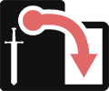 **Spent Icon:** The spent icon means the item is spent after use. This is indicated by rotating the card sideways. Spent items can be recovered the next time you perform a long rest (see [p.27](#page_27)).

 **Lost Icon:** The lost icon means the item is lost after use. This is indicated by returning the card to the pile of unused items. Lost items cannot be used again for the rest of the scenario.

Some items do not have either of these icons. This means the item applies a passive effect. There are no limits on how many times an item with a passive effect can be used.

---

<a href="#page_1">🔝</a>&nbsp; &nbsp;<a name="page_27" class="page-number">27</a>

---

### Mandatory Triggers

Mandatory triggers are effects or abilities which cannot be skipped if any part of the action is performed. In such cases, the ability or effect is highlighted in a box with an "!" in front of it. These include:
- **Negative Abilities:** The indicated ability creates a negative effect for you.
- **Lost Icons:** The card must be lost.
- **Active Icons:** The card must be placed in your active area.

### Resting

Resting is the main way to retrieve cards from your discard pile. You have two options: a short rest or a long rest. In both cases, the rest can only be performed if you have at least two cards in your hand and/or discard pile. (This includes cards with persistent bonuses in your active area (see <a href="#page_21">p.21</a>) as long as they weren't used for an action with the lost icon.) Resting always results in losing one card.

During the End of Round step (see [p.33](#page_33)), you may perform a short rest. When you short rest, return all cards from your discard pile to your hand and flip all B-side cards in your hand to their A-side, then lose one card at random from your hand. If you would like to keep the card that was lost, you can suffer 1 damage to lose a different random card instead, but this can only be done once per short rest.

During the Card Selection step (see [p.10](#page_10)), you may declare a long rest. This constitutes your entire turn for the round (instead of playing two cards) and it is performed on initiative 99. When you long rest, you follow these steps:
1. Return all cards from your discard pile to your hand and flip all B-side cards in your hand to their A-side, then lose one card of your choice from your hand (mandatory).
1. Perform "**Heal 2, self**" (optional).
1. Recover all of your spent items (optional). Items can be used during the same turn in which they are recovered.

You must lose a card as part of resting. If there are no other cards in your hand to lose, you must instead lose one of the cards in the active area that does not have the lost icon. If there are no cards in the active area that can be lost either, resolve the other steps of the rest and check for exhaustion as the start of the next round as normal.

---

<a href="#page_1">🔝</a>&nbsp; &nbsp;<a name="page_28" class="page-number">28</a>

---

### Lost Actions

 Lost actions can be performed only once. If an action has the lost icon, the card must be placed in your lost pile after the action is performed (in whole, or in part), where it will remain until the end of the scenario (unless recovered).

If the lost action was used to perform an active bonus ability, the card is still considered lost and must be moved from the active area to the lost pile once the active bonus is no longer in effect.

Some lost actions have the  icon. If you perform a lost action with this icon, the card cannot be recovered by any means until the end of the scenario. Place the card in the lost pile, but rotate it 180 degrees so that it is upside down as a reminder.

### Character Damage

When you would suffer any amount of damage, you must either reduce your hit point dial by that amount or negate the damage. Damage can be negated in two ways:
- **Ability or Effect:** You may use an active ability or effect which negates damage.

> - **Card Loss:** You may negate damage by discarding or losing cards in one of three ways:
>   - **Discard** one A-side card of your choice from your **hand**.
>   - **Discard** two B-side cards of your choice from your **hand**.
>   - **Lose** one card of your choice from your **hand or discard pile**.

If you have not yet taken your turn, the cards you selected during the Card Selection step are not in your hand or discard pile and therefore cannot be discarded or lost to negate the damage.

Even if the damage is negated, effects or conditions from the source of damage are still applied.

### Exhaustion

You can become exhausted in two ways:
- **No Hit Points:** If you reach zero on your hit point dial.
- **No Cards:** If you do not have at least two cards in your hand (to play) or at least two cards in your hand and/or discard pile (to rest) at the start of a round.

If you become exhausted, you lose the scenario.

---

<a href="#page_1">🔝</a>&nbsp; &nbsp;<a name="page_29" class="page-number">29</a>

---

## Monster Turns

On a monster’s turn, it performs abilities based on the rolled action for its monster type. Monster abilities are automated, following specific guidelines, so that very few decisions about monster behavior need to be made by you.

### Monster Cards

> Each monster type appears on one side of a double-sided monster card, which determines its stats and abilities.

A monster card can have the following:

<ol type="A">
  <li><strong>Monster Name:</strong> The name of the monster type.</li>
  <li><strong>Hit Point Value:</strong> This is the total amount of damage that a monster of this type can suffer before it dies.</li>
  <li><strong>Attack Effects:</strong> These effects apply to all attack abilities performed by monsters of this type.</li>
  <li><strong>Persistent Bonuses:</strong> These are active bonuses that all monsters of this type have for the entire scenario.</li>
  <li><strong>Condition Immunities:</strong> These are conditions that a monster of this type is prevented from gaining due to immunity.</li>
  <li><strong>Action Columns:</strong> Each monster type has a set of three action columns. After you have selected your ability cards for the round, an action is rolled for each monster type with at least one figure currently on the map. This action determines when and how the monsters of that type will act during the round. The abilities of an action are performed from top to bottom, with each ability separated by an ability line. Each action column has the following:</li>
  <li><ol type="a">
    <li><strong>Initiative Value:</strong> This value determines when the monsters of this type act during the round.</li>
    <li><strong>List of Abilities:</strong> This list indicates which abilities the monsters of this type perform on their turns, if possible, and in what order.</li>
  </ol></li>
</ol>

**Each monster performs only the abilities listed on the action rolled for its monster type for the current round.** For example, if their rolled action does not list a move ability, they will not move. If their rolled action does not list an attack ability, they will not attack.

---

<a href="#page_1">🔝</a>&nbsp; &nbsp;<a name="page_30" class="page-number">30</a>

---

### Monster Acting Order

All monsters of each type act based on the initiative value rolled for their type for the current round. During their position in the initiative order, all monsters of a type act in ascending numeric order. Each monster completes its turn before the next monster acts.

### Focus

> Because Buttons & Bugs is a solo game, you are the sole focus of the monsters. They will target you with all attacks and negative targeted abilities.

The monster identifies the closest hex from which it can perform its attack abilities; this is called its "attack hex." If the monster cannot attack on its turn, either because it does not have an attack ability or because it is disarmed, it moves as if for a single-target melee attack. The monster follows the shortest path to its attack hex. If it can't reach the attack hex this turn, it will take the shortest path which brings it as close as possible to the attack hex. If it can't get closer to the attack hex this turn, it will not move.

"Closest" and "shortest" mean using the fewest movement points to navigate around obstacles and hazards (if possible) and/or through difficult terrain using the normal, jumping, and flying movement rules.

#### Path Priority

Monsters always prioritize a path that triggers the fewest hazards, even when that means not maximizing targets. Monsters only trigger hazards when there is no other viable path to attack an enemy. For example, if a monster could attack by moving two hexes through a hazard hex or by moving 10 hexes and avoiding the hazard, it would take the 10-hex path. It does not matter whether the monster can actually reach the end of the path on its current turn.

#### No Focus

If you are invisible or if the monster cannot reach a valid hex, given infinite movement, from which it can perform its attack, the monster does not move or attack but still performs any other abilities listed on its ability card.

---

<a href="#page_1">🔝</a>&nbsp; &nbsp;<a name="page_31" class="page-number">31</a>

---

### Monster Movement

Once a monster has identified its path to an attack hex, it then performs the abilities listed on its ability card in order — the first of which is usually its movement. A monster only moves on its turn if " **X**" is listed in its rolled action.

A monster always uses the fewest movement points required to maximize its attacks for its current turn. If a monster cannot attack on its current turn, it only moves if it can shorten the path to its attack hex. If an adjacent monster is performing a ranged attack, it will first move away so it doesn’t have disadvantage, if able. 

Having abilities other than  listed on its ability card does not affect a monster’s movement in any way. It will simply move according to the above rules and then perform its other abilities as fully as possible.

### Monster Attacks

A monster only attacks on its turn if " **X**" is listed in its rolled actions. The range of the attack is specified on the ability. If no range is specified, it is a melee attack.

### Other Monster Abilities

- **Active Bonuses:** Persistent bonuses on the monster card are active at all times. Round bonuses from rolled actions are only active once the monster has taken its turn, but they remain active until the end of the round. Multiple active bonuses stack with one another as a single effect.
- **Heal Abilities:** The monster heals itself or an ally within the specified range. It always targets the monster within range that has the greatest difference between its current and maximum hit point values.
- **Negative Targeted Abilities:** These are targeted in the same way as attack abilities, but will not affect how the monster moves.
- **Positive Conditions:** The monster applies the condition to itself or an ally within the specified range. It always targets the monster at the closest range that does not already have the condition. If there is a tie for closest range, it targets the monster that acts earliest in the initiative order.

---

<a href="#page_1">🔝</a>&nbsp; &nbsp;<a name="page_32" class="page-number">32</a>

---

### Monsters and Elements

Monsters can infuse and consume elements.

An infusion occurs immediately when the action is rolled. A monster consumes an element only when performing an ability that benefits from consuming the element. When the first monster of a type consumes an element, that consumption benefits every monster of that type.

If a monster consumes a wild or mixed element, you decide which infusion is consumed.

### Spawning Monsters

If the scenario rules indicate that monsters spawn in specific locations at specific times, add them to the map when specified. If a specified location is not empty, place the monster in the closest empty hex instead.

Spawned monsters act during the same round in which they were added to the map. If a newly added monster type does not have rolled action for the current round, roll one now.

Check the initiative value for each added monster. If their initiative value comes after the acting figure’s initiative value, they will act in normal initiative order. If their initiative value comes before the acting figure’s initiative value, they will act next. When multiple new monster types would act next, they act based on initiative values.

### Monster Damage and Death

Each monster’s hit points are tracked using the monster hit point dial that corresponds to the color of the cube that represents it on the map.

When a monster suffers damage, reduce its hit point dial by that amount. As soon as the monster has zero hit points, it dies.

When a monster dies, remove its cube from the map and clear all conditions from its monster tray.

No attack effects can be applied to a monster after it dies. If a monster dies while performing one of its own abilities, it cannot perform any other abilities.

---

<a href="#page_1">🔝</a>&nbsp; &nbsp;<a name="page_33" class="page-number">33</a>

---

## End of Round

After all figures on the map have taken a turn, the End of Round step begins. Perform the following operations in order:
1. Trigger any end-of-round effects in the scenario rules or on items or ability cards.
1. For ability cards in the active area with round bonuses:
  - A-side card: flip it to its B-side and return it to your hand
  - B-side card: place it in your discard pile 
  - If the card has a lost icon, place it in your lost pile
1. If you have at least two cards in your hand and/or discard pile, you may perform a short rest (see [p.27](#page_27)).

### Tracking Rounds

If a scenario has effects that occur at specific times, the rounds can be tracked using a spare monster hit point dial. Advance the round dial by one at the end of each round.

---

<a href="#page_1">🔝</a>&nbsp; &nbsp;<a name="page_34" class="page-number">34</a>

---

# Ending a Scenario

When a scenario ends, it is either lost or completed, depending on whether the scenario goal is met. The scenario is lost if you become exhausted or some other loss condition listed in the scenario rules occurs. The scenario is completed if the specific goal listed in the scenario rules is achieved.

Once the end of the scenario is triggered, play continues until the current round is over, and then the scenario ends. If the scenario would be both lost and completed in the same round, the scenario is lost.

You recover all of your discarded and lost ability cards, recover all of your spent and lost items, and reset your hit point dial to your maximum hit point value. All conditions are removed.

## Lost Scenario

If the scenario was lost, you must attempt the scenario again.

## Completed Scenario

If the scenario was completed, read the conclusion of the scenario, which is found in the scenario entry on the scenario card. The conclusion will indicate which scenario to play next in the campaign.

---

<a href="#page_1">🔝</a>&nbsp; &nbsp;<a name="page_35" class="page-number">35</a>

---

> # The Adventure Begins
> 
> At this point, you should be ready to start your adventure. Flip over the cover card of the scenario deck, read the story text on the back, then begin the journey with Scenario 1. The following rules will be helpful at the end of Scenario 1 and Scenario 2, when, respectively, items and leveling up are introduced.
> 
> ## Item Supply
> 
> There are two items printed at the top and bottom of each card in the scenario deck. Once Scenario 1 is complete, at the start of each scenario, the items on any card that has been resolved or skipped (all previous scenarios and the cover and collector cards) are available to equip. Only one item on each card can be equipped at one time, but different items can be equipped at the beginning of each scenario.
> 
> ## Character Progression
> 
> There is a level indicator to the right of the scenario's title, which determines the level of your character in the scenario. Your level determines four things:
> - How many level 1 ability cards you can upgrade (see below)
> - Which modifier table you should use (use the side of a card that matches the scenario level)
> - Your maximum hit point value (this is printed on your character mat as a red number below your indicated level)
> - How many  items you can equip (half your level, rounded up)
> 
> ### Upgraded Ability Cards
> 
> Each level 1 card you have can be upgraded for a specific level 2 card at the start of a scenario. For each additional scenario level after level 1, one card is upgraded to level 2. You decide which cards to upgrade for each scenario separately. 
> 
> A list of the ability cards and their respective upgrades is listed on the back of each character card.

---

<a href="#page_1">🔝</a>&nbsp; &nbsp;<a name="page_36" class="page-number">36</a>

---

# Appendix A: Component Inventory
- 1 Learn to Play book
- 6 Character cards
- 48 Ability cards
- 14 Modifier cards
- 10 Monster cards
- 22 Scenario cards
- 1 Icon Reference card
- 2 Modifier trays
- 4 Monster trays
- 5 Hit Point dials
- 24 Condition tokens
- 6 Plastic Character miniatures
- 10 Plastic cubes
- 1 Custom die

**Missing parts?** If you discover that you are missing any parts from your game, you can request replacements at [cephalofair.com/contact](https://cephalofair.com/contact).

---

<a href="#page_1">🔝</a>&nbsp; &nbsp;<a name="page_37" class="page-number">37</a>

---

# Appendix B: Monster Turn Guide

## 1. Initial Check

1. Check for Conditions and Attack Ability
  - Any monster with  or without an attack ability moves as if for a single-target melee attack but does not perform an attack.
  - Any monster with  ignores all move abilities but performs any other viable actions.
1. Check for Movement Paths 
  - Check for movement paths to attack hexes (i.e., hexes from which an attack can be performed). If no path exists (due to obstacles or other figures), the monster will not move or attack.

## 2. Find Path

The monster finds a path to an attack hex with the following priority list:
1. The path with the fewest hazards.
1. The path that requires the fewest movement points.

## 3. Perform Monster Abilities

Each monster performs all of its abilities from top to bottom (move, attack, and other abilities), fully resolving each ability before starting the next. For move abilities, observe the following rules:
- The monster must end its movement with a shorter path to its attack hex than it had before or it will not move.
- The monster chooses a movement path that triggers the fewest negative hexes.
- The monster moves toward a hex from which it can attack.
- If the monster could move to multiple hexes that maximize the previous priorities, it moves to the hex that requires the fewest movement points.
- In cases where monster movement is still ambiguous, you decide.

---

<a href="#page_1">🔝</a>&nbsp; &nbsp;<a name="page_38" class="page-number">38</a>

---

# Appendix C: Important Reminders

### Attacks and Damage

- A separate attack modifier is rolled for each target of an attack ability.

> - The attack modifier tracking cube should be moved after each attack, including after each individual roll when attacking multiple targets.

- A shield bonus only reduces damage from attacks, not from other sources, but the bonus applies to all incoming attacks while active.
- Even if an attack deals no damage (e.g., when a  modifier is rolled), all added effects of the attack are still applied.

> - You may negate all damage from one source by discarding or losing cards in one of three ways:
>   - **Discard** one A-side card of your choice from your **hand**.
>   - **Discard** two B-side cards of your choice from your **hand**.
>   - **Lose** one card of your choice from your **hand or discard pile**.

### Monsters

- Each round, an action is rolled for each type of monster on the map. All monsters of a single type will use the same rolled action.
- A monster only performs the abilities listed on its rolled action for the round.
- A monster does not apply any active bonuses from its rolled action until its turn.
- If a monster cannot find an attack hex, it will not move.
- If a monster will not be performing an attack on its turn or is disarmed, it moves as if for a single-target melee attack.

### Character

> - You initially use the base modifier table on the modifier tray. Advanced attack modifier tables are used during higher level scenarios.

- You cannot perform two top actions or two bottom actions.
- For the basic actions, " **2**" is always a top action, and " **2**" is always a bottom action.

### Elements

> - Infused elements are available as soon as their icon is visible on a chosen ability card, an ability card in your hand or active area, or on a rolled monster action.
> - An infused element is immediately unavailable if the ability card it is visible on is flipped, discarded, or lost. An infused element visible on a rolled monster action is no longer available as soon as all monsters of that type are killed.
> - Multiple instances of each element can be infused at once, but each instance of an infused element can be consumed no more than once per round.

- When a monster type consumes an element, all monsters of the type gain the benefits of the consumption.

### Scenario Details

> - The scenario level is listed in the scenario entry and determines the number of level 2 ability cards and items you can select.
> - You can upgrade one ability card for each level beyond the first.

- You can each equip a number of  items equal to half the scenario level (rounded up).
- The end of a scenario can only occur at the end of a round, even if the objective is met mid-round.

---

<a href="#page_1">🔝</a>&nbsp; &nbsp;<a name="page_39" class="page-number">39</a>

---

# Appendix D: Item Index

| Item                      | Type | Scen. | Use | Effect |
| :---                      |:---: | :---: |:---:| :---   |
| Venomous Fang	            |  |	 1	|  |	During your melee attack, add .	 |
| Rosethorn Knife	          |  |	 1	|                                                                 |	During your attack,  to add  1.	 |
| Button Shield	            |  |	 3	|  |	During an enemy's attack, gain  1.	 |
| Spring Hammer	            |    |	 3	|  |	During your melee attack, add  2.	 |
| Tanglevine Whip	          |  |	 4	|                                                                 |	During your attack,  to add .	 |
| Iron Nail	                |    |	 4	|  |	During your turn, add  2 to all your melee attacks.	 |
| Chestnut Shell Shield	    |  |	 8	|  |	During an enemy's attack, gain  1,  1.	 |
| Fishing Hook and Line	    |    |	 8	|  |	During your ranged attack, add  2,  2.	 |
| Sewing Needles	          |  |	11	|  |	During your attack, add  1.	 |
| Coin Shield	              |  |	12	|  |	During an enemy's attack, gain  2.	 |
| Sharpened Pencil	        |    |	12	|  |	During your single-target melee attack, add: 	 |
| Shrunken Longsword	      |  |	13	|  |	During your melee attack, add +1 .	 |
| Shrunken Longbow	        |    |	13	|  |	During your ranged attack, add +1 ,  1.	 |
| Playing Card Shield	      |    |	15	|  |	During an enemy's attack, gain  4.	 |
| Glass Shard	              |  |	15	|  |	During your melee attack, add .	 |
| Pocket Knife	            |    |	19	|  |	During your melee attack, add +1 ,  2, .	 |
| Iridescent Shell Shield	  |  |	19	|  |	During your turn, gain  1 for the round. Create .	 |

| Item                      | Type | Scen. | Use | Effect |
| :---                      |:---: | :---: |:---:| :---   |
| Sparrow Skull Helm	      |  |	 1	|  |	During your attack, gain advantage.	 |
| Bottle Cap Helm	          |  |	 1	|  |	During an enemy's attack, treat its  attack modifier as a  attack modifier.	 |
| Old Spring                |  |	 1	|  |	During your turn, add  to all your movement.	 |
| Shrunken Weathered Boots  |  |	 1	|  |	During your movement, add +1 .	 |
| Drop of Clean Water       |  |	 2	|                                                                 |	During your turn,  to remove one negative condition.	 |
| Drop of Power Potion	    |  |	 2	|      |	During your turn, add +1  to all your attacks.	 |
| Leftover Table Scraps	    |  |	 5	|  |	During your turn,  1 self.	 |
| Magnetic Needle	          |  |	 5	|      |	During your turn, control one enemy within  5:  2.	 |
| Nightshade Pollen	        |  |	 6	|                                                                 |	After an enemy's attack,  to  that enemy.	 |
| Robin's Feather Arrows	  |  |	 6	|                                                                 |	During your single-target ranged attack,  to add +1 ,  1.	 |
| Volatile Powder	          |  |	 7	|      |	During your single-target ranged attack, add: 	 |
| Drop of Healing Potion	  |  |	 7	|      |	During your turn,  3 self.	 |
| Lubricating Oil	          |  |	 9	|  |	During your movement, add +2 .	 |
| Brass Cog	                |  |	 9	|  |	After determining initiative, increase or decrease your initiative by 10.	 |
| Drop of Stamina Potion	  |  |	10	|      |	During your turn,  one level 1 card from your hand or discard pile to its A-side.	 |
| Drop of Element Potion	  |  |	10	|      |	During your turn, create .	 |
| Pinch of Doom Powder	    |  |	11	|      |	During your attack, add , .	 |
| Lucky Cat's-Eye Marble	  |  |	14	|  |	During your attack, treat your  attack modifier as a  attack modifier.	 |
| Embernettle	              |  |	14	|                                                                 |	During an enemy's attack,  to  that enemy.	 |
| Drop of Stamina Elixir	  |  |	16	|      |	During your turn,  one card from your hand or discard pile to its A-side.	 |
| Drop of Haste Elixir	    |  |	16	|      |	After performing the top action of an ability card, also perform its bottom action.	 |
| Drop of Strength Potion	  |  |	17	|      |	During your turn,  self.	 |
| Prismatic Gem	            |  |	17	|  |	During your attack,  to add +1 .	 |
| Brightlure Gem	          |  |	18	|                                                                 |	After your attack,  to control the target of the attack:  1.	 |
| Duskhaze Gem	            |  |	18	|                                                                 |	During an enemy's attack,  to gain  1 and  that enemy.	 |

---

<a href="#page_1">🔝</a>&nbsp; &nbsp;<a name="page_40" class="page-number">40</a>

---

# Appendix E: Component Errata

The following is a complete list of all component errata. If a discrepency exists between a physical copy of the game and these errata, the game should be played as if the physical components match the description here.

### Ability Cards

- **Freeezing Vortex** — The first ability of the bottom action should read as follows: " 3  all enemies within  4". The range was misprinted as 2 in the first printing.

### Monster Cards

- **Earth Demon** — The second action contains an erroneous unicode box following the element consumtion in the first printing. This box should simply be ignored.

---

<a href="#page_1">🔝</a>&nbsp; &nbsp;<a name="page_41" class="page-number">41</a>

---

# Credits

<table>
<tr><td>
  

Inspired by <em>Gloomholdin</em>

<h3 id="design-and-development">Design and Development</h3>

<h4 id="designers">Designers</h4>

Joe Klipfel and Nikki Valens

<h4 id="developer-and-project-manager">Developer and Project Manager</h4>

Nikki Valens

<h4 id="scenario-20-design">Scenario 20 Design</h4>

Misty Burgess

<h3 id="illustration">Illustration</h3>

<h4 id="cover-character-and-monster-artist">Cover, Character, and Monster Artist</h4>

Mofei Wang

<h4 id="map-artist">Map Artist</h4>

Yannis Cardin

<h4 id="art-directors">Art Directors</h4>

BJ Hensley and Arch Anderson

<h3 id="3d-modeling">3D Modeling</h3>

<h4 id="miniature-sculptors">Miniature Sculptors</h4>

Chris Lewis

<h3 id="graphic-design">Graphic Design</h3>

<h4 id="lead-graphic-designer">Lead Graphic Designer</h4>

Arch Anderson

<h4 id="graphic-designer">Graphic Designer</h4>

Jason D. Kingsley

<h4 id="learn-to-play-layout-artist">Learn to Play Layout Artist</h4>

Jason D. Kingsley

</td><td>

<h3 id="writing">Writing</h3>

<h4 id="narrative-writer">Narrative Writer</h4>

Isaac Childres

<h4 id="technical-writers">Technical Writers</h4>

Nikki Valens, Isaac Childres, Jason D. Kingsley

<h4 id="editor">Editor</h4>

Jaym Gates

<h3 id="production">Production</h3>

<h4 id="executive-producer-and-production-lead">Executive Producer and Production Lead</h4>

Price Johnson

<h3 id="playtesting">Playtesting</h3>

<h4 id="playtest-coordinator">Playtest Coordinator</h4>

Nikki Valens

<h4 id="campaign-playtesters">Campaign Playtesters</h4>

Amr Ammourazz, Calvin Wong Tze Loon 黃子倫, David Gregg, Duncan Henry, Fiona van den Heiligenberg, Hong Di-Anne, Joseph Bozarth, Kyle Kemp, Larry, Braden, and Maks Marburger, Misty Burgess, Rachel Woodfint, Z Svela

</td><td>

<h4 id="additional-playtesters">Additional Playtesters</h4>

Alexander Norback, Alisandra Livingston, Andrew Brown, Ben Donovan, Brook Laing, Carl Skelton, Clay Kramer, Conrad Gregory Oakes, Corbin Neuhauser, Dan Sawade, Daniel J Burras, David Hodd, David Ross Pascoe, John Morgan, Joshua Ryan Jones, Joshua Trotta, Julian Naydichev, Julie Lauzon, Kelly Nulty, Mike Clemson, Mike Clinton, Nathan Moteberg, Nicole Koprince, Peter Koprince, Ragnar Sigurður Ragnarsson, Ryan Huntley, Samuel Muriello, Sean Lim

<h3 id="crowdfunding">Crowdfunding</h3>

<h4 id="marketing-and-crowdfunding-manager">Marketing and Crowdfunding Manager</h4>

Ross Thompson

<h3 id="twitch-producer">Twitch Producer</h3>

Ruel Gaviola

<h4 id="backerkit">BackerKit</h4>

<h3 id="special-thanks">Special Thanks</h3>

“Thank you to my wife, Krista, who tirelessly supports my game design shenanigans.” —Joe Klipfel

</td></tr>
</table>

---

<a href="#page_1">🔝</a>&nbsp; &nbsp;<a name="page_42" class="page-number">42</a>

---

# Quick Reference

<table>
<tr><td>

<h3>Beginning a Scenario (<a href="#page_7">p.7</a>)</h3>

<ol>
<li>Select a scenario.</li>
<li>Read the scenario entry.</li>
<li>Retrieve all monsters for the scenario.</li>
<li>Resolve scenario effects and flip to the map side.</li>
<li>Place monster cards in their respective trays.</li>
<li>Place monster cubes and character mini.</li>
<li>Set character level and monster difficulty.</li>
<li>Place conditions nearby.</li>
<li>Select which items to bring.</li>
<li>Select upgraded ability cards.</li>
<li>Set all hit point values to maximum.</li>
<li>Apply any remaining scenario effects.</li>
</ol>

<h3>Scenario Phase (<a href="#page_6">p.6</a>)</h3>

<ol>
<li>Start of Round Effects</li>
<li>Card Selection</li>
<li>Ordering of Initiative</li>
<li>Character and Monster Turns</li>
<li>End of Round</li>
</ol>

<h3>Targeted Abilities (<a href="#page_13">p.13</a>)</h3>

<ul>
<li>Attack (<a href="#page_18">p.18</a>)</li>
<li>Conditions (<a href="#page_20">p.20</a>)</li>
<li>Heal (<a href="#page_21">p.21</a>)</li>
<li>Forced Movement (<a href="#page_23">p.23</a>)</li>
<li>Controlling Monsters (<a href="#page_24">p.24</a>)</li>
</ul>

</td><td>

<h3>Attack Modification Order (<a href="#page_18">p.18</a>)</h3>

<ol>
<li>Apply all attack bonuses and penalties.</li>
<li>Roll and apply an attack modifier card.</li>
<li>Apply the target's shield bonus.</li>
</ol>

<h3>End of Round (<a href="#page_33">p.33</a>)</h3>

<ol>
<li>Trigger any end-of-round effects.</li>
<li>Remove all round bonuses from your active area.</li>
<li>Perform a short rest if desired.</li>
</ol>

<h3>Ending a Scenario (<a href="#page_34">p.34</a>)</h3>

<h4>Whether the Scenario was Lost or Completed:</h4>

<ul>
<li>Recover all discarded and lost items and ability cards.</li>
<li>Reset character health dial to maximum.</li>
<li>Remove all conditions.</li>
</ul>

<h4>If the Scenario was Lost:</h4>

<ul>
<li>Replay the scenario.</li>
</ul>

<h4>If the Scenario was Completed:</h4>

<ul>
<li>Read the scenario conclusion.</li>
<li>Scenario indicates which scenario to play next.</li>
</ul>

<h3>Timing of Attack Effects</h3>

<ul>
<li>+X Attack (<a href="#page_18">p.18</a>) – during damage resolution</li>
<li>Pierce (<a href="#page_19">p.19</a>) – during damage resolution</li>
<li>+X Target (<a href="#page_13">p.13</a>) – after the attack resolves</li>
<li>Conditions (<a href="#page_20">p.20</a>) – after the attack resolves</li>
<li>Forced Movement (<a href="#page_23">p.23</a>) – after the attack resolves</li>
<li>Other Added Effects (<a href="#page_19">p.19</a>) – after the attack resolves</li>
</ul>

</td></tr>
</table>

### Scenario Level ([p.8](#page_8))

|	Scenario Level	          |	1	|	2	|	3	|	4	|	5	|
| :---                      |:---:|:---:|:---:|:---:|:---:|
|	Upgraded Ability Cards	  |	0	|	1	|	2	|	3	|	4	|
|	Character Modifier Level	|	1	|	2	|	3	|	4	|	5	|
|	 Items	                    |	1	|	1	|	2	|	2	|	3	|

- The monster modifier difficulty remains at “standard” throughout the entire campaign, but this difficulty can be increased or decreased to affect monster difficulty as desired.

